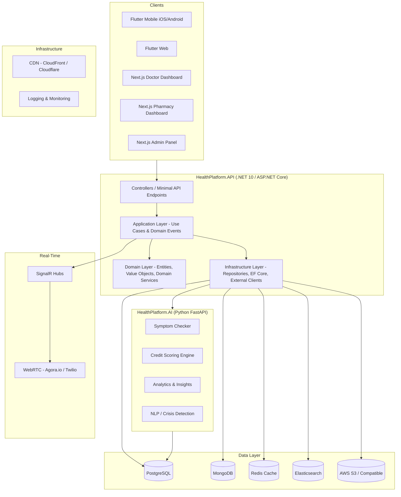
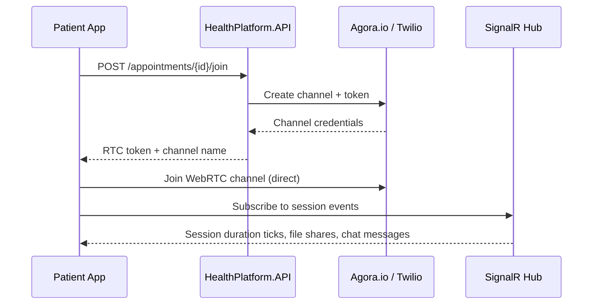
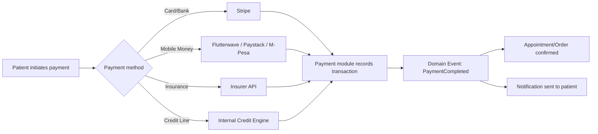
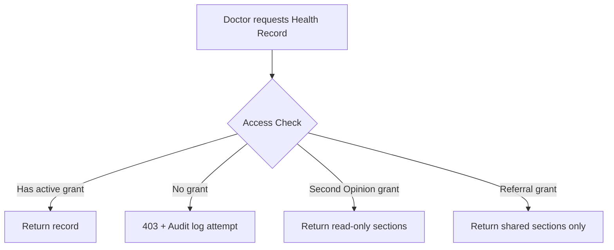

# Design Document: Online Healthcare Platform

## Overview

The Online Healthcare Platform is a comprehensive digital health ecosystem connecting patients, doctors, pharmacies, insurers, labs, and platform operators. It delivers telemedicine, appointment booking, e-prescriptions, medication ordering and adherence, lab test ordering, mental health services, maternal/pediatric care, referral management, wellness tracking, and emergency response — all within a single, HIPAA/GDPR-compliant platform.

### MVP scope (pilot deployment)

The full design describes the **long-term** system. For the **first working release** (Zimbabwe-first pilot), use **[mvp.md](./mvp.md)** in the `planning/` folder: virtual consults, single payment provider, prescriptions and minimal health records, notifications, and doctor licence verification — without insurance, credit, instalments, full AI, labs, or pharmacy fulfilment unless explicitly pulled into the pilot.

### Design Goals

- **Patient-centric**: Every workflow starts and ends with the patient's health outcome.
- **Extensible**: Clean architecture with clear domain boundaries makes it straightforward to extract services or scale to microservices in the future.
- **Compliant**: AES-256 at rest, TLS 1.2+ in transit, full audit logging, RBAC, and MFA throughout.
- **Resilient**: In-process domain events with outbox pattern; graceful degradation on external service failures.
- **Inclusive**: Multi-language, accessibility-first, multi-currency payment support.

### Key Stakeholders

| Actor | Primary Interface |
|---|---|
| Patient | Flutter mobile/web app |
| Doctor | Flutter mobile app + Next.js dashboard |
| Pharmacy | Next.js dashboard |
| Lab Partner | Next.js dashboard / REST API |
| Insurer | REST API integration |
| Admin | Next.js admin panel |
| AI/ML Services | Python FastAPI project (separate project within the monorepo) |

---

## Architecture

### High-Level System Architecture

The platform uses **Clean Architecture** across two projects within the Online Healthcare monorepo:

1. **HealthPlatform.API** — .NET 10 / ASP.NET Core application (the main backend)
2. **HealthPlatform.AI** — Python FastAPI project (AI/ML services: symptom checker, credit scoring, analytics, NLP)

The two projects communicate over HTTP (REST). The .NET backend calls the Python AI project's internal endpoints; no external traffic reaches the Python project directly.



### Clean Architecture Layer Responsibilities

| Layer | Project Path | Responsibility |
|---|---|---|
| Domain | `src/HealthPlatform.Domain` | Entities, value objects, domain events, domain service interfaces, business rules |
| Application | `src/HealthPlatform.Application` | Use cases (commands/queries via MediatR), domain event handlers, DTOs, validator interfaces |
| Infrastructure | `src/HealthPlatform.Infrastructure` | EF Core repositories, PostgreSQL/MongoDB/Redis/Elasticsearch clients, external HTTP clients (payment gateways, Agora/Twilio, AI services), background jobs (Hangfire), notification delivery |
| API | `src/HealthPlatform.API` | ASP.NET Core controllers / minimal API endpoints, SignalR hubs, auth middleware, request validation |

### Domain Modules

Rather than separate deployable services, the domain is organized into **feature modules** within the single application. Each module owns its entities, use cases, and repository interfaces.

| Module | Responsibility |
|---|---|
| Identity | Patient/Doctor/Pharmacy registration, profile CRUD, license verification, MFA, account lockout |
| Appointments | Slot management, booking, cancellation, reminders, slot hold via Redis |
| Telemedicine | Session lifecycle, WebRTC signaling, recording consent |
| Prescriptions | E-prescription CRUD, expiry, dispensing, drug interaction checks |
| Pharmacy | Order management, inventory, delivery tracking |
| Payments | Payment gateway abstraction, credit line, instalment plans, receipts |
| Notifications | Multi-channel delivery (push/SMS/email), retry logic, preferences |
| HealthRecords | Longitudinal records, access control, PDF export |
| Labs | Lab orders, result ingestion, radiology reports |
| Referrals | Doctor-to-doctor referrals, consent, status tracking |
| Queue | Virtual clinic queues, wait time estimation |
| Admin | Platform governance, verification, dispute management, config |
| Search | Doctor/pharmacy/lab discovery via Elasticsearch |
| Wellness | Health goals, care plans, vaccination records |
| Maternal | Antenatal records, birth plans, child profiles, growth tracking |
| MentalHealth | Therapy sessions, mood logs, crisis protocol |
| Ratings | Post-consultation ratings and reviews |

### Python AI Project (HealthPlatform.AI)

A separate FastAPI project within the same monorepo at `services/ai/`. It exposes internal HTTP endpoints consumed only by the .NET backend. It reads from the shared PostgreSQL database (read replica or same instance in dev).

| Module | Responsibility |
|---|---|
| Symptom Checker | Symptom triage, specialist recommendation |
| Credit Scoring | Payment history analysis, credit limit computation |
| Analytics | Dashboard aggregations, exportable reports |
| NLP / Crisis Detection | Emergency keyword detection in free-text inputs |

---

## Components and Interfaces

### API Layer (ASP.NET Core)

- All client traffic hits the ASP.NET Core application directly. No separate API gateway is needed at this stage.
- REST endpoints (`/api/v1/...`) for Flutter clients and third-party integrations (insurers, lab partners).
- SignalR hubs for real-time features (telemedicine chat, queue updates, dashboard refreshes).
- JWT validation via ASP.NET Core authentication middleware (tokens issued by the application's own auth module using ASP.NET Core Identity + custom claims).
- Rate limiting via ASP.NET Core rate limiting middleware.

### Authentication & Identity

- **ASP.NET Core Identity** for user management (patients, doctors, pharmacies, admins).
- JWT bearer tokens with role claims (`patient`, `doctor`, `pharmacy`, `lab_partner`, `insurer`, `admin`).
- MFA enforced for Doctor, Pharmacy, and Admin roles (TOTP or SMS OTP).
- New-device detection triggers step-up authentication for all roles.
- Account lockout after 5 consecutive failed logins; unlock via email/SMS.

### Real-Time Communication



- **WebRTC via Agora.io/Twilio**: Handles video/audio streams directly between clients. The platform never proxies media.
- **SignalR**: Used for in-session chat, file sharing events, queue position updates, and real-time dashboard refreshes. Redis backplane for SignalR when scaling horizontally.

### Notification Module

- Triggered by domain events published in-process via MediatR.
- Delivery channels: FCM/APNs (push), Twilio/Africa's Talking (SMS), SendGrid/SES (email).
- Per-user preference store in PostgreSQL; Redis cache for hot preferences.
- Critical notifications (emergency alerts, medication reminders) fall back to SMS if push fails.
- Retry queue: up to 3 retries at 5-minute intervals for failed deliveries; final status logged.
- Background retry jobs run via Hangfire.

### Search Module (Elasticsearch)

- Doctor index: name, specialty, rating, location (geo_point), fee range, availability.
- Pharmacy index: name, location, stock summary.
- Lab Partner index: name, location, test types, pricing.
- Index updates triggered synchronously (or via background job) when profiles or availability change.
- Geo-distance queries for proximity sorting.

### Payment Module



- Payment gateway abstraction layer: all gateways implement `IPaymentGateway` interface.
- Credit scoring runs as a Python FastAPI endpoint in `HealthPlatform.AI`, reading from PostgreSQL payment history.
- Credit limit recalculated on each payment event; patient notified on limit change.
- Instalment plans stored as scheduled payment records; due-date reminders via background jobs (Hangfire).

---

## Data Models

### Patient

```
Patient {
  id: UUID (PK)
  phone_number: string (unique)
  email: string (unique, nullable)
  auth_provider: enum(phone, email, google, apple)
  full_name: string
  date_of_birth: date
  blood_type: enum(A+, A-, B+, B-, AB+, AB-, O+, O-)
  known_allergies: string[]
  chronic_conditions: string[]
  profile_photo_url: string (S3 key)
  preferred_language: string (BCP-47)
  credit_score: decimal
  credit_limit: decimal
  created_at: timestamp
  updated_at: timestamp
}
```

### Doctor

```
Doctor {
  id: UUID (PK)
  full_name: string
  license_number: string (unique)
  specialty: string
  years_of_experience: int
  clinic_address: string
  clinic_location: geo_point
  virtual_fee: decimal
  physical_fee: decimal
  bio: string
  profile_photo_url: string
  credentials_url: string (S3 key)
  verification_status: enum(pending, verified, rejected, suspended)
  average_rating: decimal
  total_reviews: int
  created_at: timestamp
}
```

### Availability Slot

```
AvailabilitySlot {
  id: UUID (PK)
  doctor_id: UUID (FK -> Doctor)
  day_of_week: enum(Mon..Sun)
  start_time: time
  end_time: time
  slot_duration_minutes: int
  appointment_type: enum(virtual, physical, both)
  is_active: boolean
}
```

### Appointment

```
Appointment {
  id: UUID (PK)
  patient_id: UUID (FK -> Patient)
  doctor_id: UUID (FK -> Doctor)
  slot_id: UUID (FK -> AvailabilitySlot)
  appointment_type: enum(virtual, physical, dental, optical, therapy)
  status: enum(pending_payment, confirmed, in_progress, completed, cancelled, no_show)
  scheduled_at: timestamp
  confirmed_at: timestamp (nullable)
  cancelled_at: timestamp (nullable)
  cancellation_reason: string (nullable)
  payment_id: UUID (FK -> Payment)
  created_at: timestamp
}
```

### Telemedicine Session

```
TelemedicineSession {
  id: UUID (PK)
  appointment_id: UUID (FK -> Appointment)
  channel_name: string
  rtc_provider: enum(agora, twilio)
  mode: enum(video, audio, chat)
  status: enum(waiting, active, ended, interrupted)
  recording_consent: boolean
  recording_url: string (S3 key, nullable)
  started_at: timestamp (nullable)
  ended_at: timestamp (nullable)
  duration_seconds: int
  session_summary: text (MongoDB ref)
}
```

### Prescription

```
Prescription {
  id: UUID (PK)
  doctor_id: UUID (FK -> Doctor)
  patient_id: UUID (FK -> Patient)
  appointment_id: UUID (FK -> Appointment, nullable)
  medications: [
    {
      name: string
      dosage: string
      frequency: string
      duration_days: int
      special_instructions: string
    }
  ]
  status: enum(active, dispensed, cancelled, expired)
  issued_at: timestamp
  expires_at: timestamp
  cancellation_reason: string (nullable)
}
```

### Medication Schedule & Adherence

```
MedicationSchedule {
  id: UUID (PK)
  prescription_id: UUID (FK -> Prescription)
  patient_id: UUID (FK -> Patient)
  medication_name: string
  dose_times: timestamp[]
  status: enum(active, completed)
}

AdherenceEvent {
  id: UUID (PK)
  schedule_id: UUID (FK -> MedicationSchedule)
  patient_id: UUID (FK -> Patient)
  scheduled_at: timestamp
  recorded_at: timestamp (nullable)
  status: enum(taken, missed, late)
}
```

### Pharmacy & Order

```
Pharmacy {
  id: UUID (PK)
  name: string
  address: string
  location: geo_point
  contact_email: string
  contact_phone: string
  verification_status: enum(pending, verified, suspended)
}

MedicationOrder {
  id: UUID (PK)
  patient_id: UUID (FK -> Patient)
  pharmacy_id: UUID (FK -> Pharmacy)
  prescription_id: UUID (FK -> Prescription)
  delivery_type: enum(delivery, pickup)
  delivery_address: string (nullable)
  status: enum(pending, confirmed, preparing, dispatched, delivered, rejected)
  payment_id: UUID (FK -> Payment)
  tracking_url: string (nullable)
  created_at: timestamp
  updated_at: timestamp
}

InventoryItem {
  id: UUID (PK)
  pharmacy_id: UUID (FK -> Pharmacy)
  medication_name: string
  quantity: int
  low_stock_threshold: int
  updated_at: timestamp
}
```

### Payment & Credit

```
Payment {
  id: UUID (PK)
  patient_id: UUID (FK -> Patient)
  amount: decimal
  currency: string (ISO 4217)
  payment_method: enum(card, bank_transfer, mobile_money, insurance, credit_line, instalment)
  gateway: enum(stripe, flutterwave, paystack, mpesa, internal)
  gateway_reference: string
  status: enum(pending, completed, failed, refunded)
  receipt_url: string (S3 key, nullable)
  created_at: timestamp
}

InstalmentPlan {
  id: UUID (PK)
  patient_id: UUID (FK -> Patient)
  payment_id: UUID (FK -> Payment)
  total_amount: decimal
  instalment_amount: decimal
  frequency: enum(weekly, biweekly, monthly)
  total_instalments: int
  paid_instalments: int
  next_due_date: date
  status: enum(active, completed, defaulted)
}
```

### Health Record

```
HealthRecord {
  id: UUID (PK)
  patient_id: UUID (FK -> Patient)
  -- stored in PostgreSQL for structured queries
}

HealthRecordEntry {  -- MongoDB document
  _id: ObjectId
  health_record_id: UUID
  entry_type: enum(consultation_note, diagnosis, prescription_ref, allergy, vital, lab_result_ref, vaccination)
  content: object  -- flexible schema per entry_type
  authored_by: UUID (Doctor or Patient id)
  created_at: timestamp
  is_visible_to_patient: boolean
}

HealthRecordAccess {
  id: UUID (PK)
  health_record_id: UUID (FK -> HealthRecord)
  granted_to: UUID (Doctor id)
  granted_at: timestamp
  revoked_at: timestamp (nullable)
  access_type: enum(full, read_only, sections)
  sections: string[] (nullable)
}
```

### Lab Test & Results

```
LabOrder {
  id: UUID (PK)
  patient_id: UUID (FK -> Patient)
  doctor_id: UUID (FK -> Doctor, nullable)
  lab_partner_id: UUID (FK -> LabPartner)
  test_type: string
  status: enum(pending_approval, approved, dispatched, completed)
  payment_id: UUID (FK -> Payment)
  created_at: timestamp
}

LabResult {
  id: UUID (PK)
  lab_order_id: UUID (FK -> LabOrder)
  result_type: enum(report, imaging, radiology)
  file_url: string (S3 key)
  is_critical: boolean
  uploaded_at: timestamp
  annotations: text (MongoDB ref, nullable)
}
```

### Referral

```
Referral {
  id: UUID (PK)
  referring_doctor_id: UUID (FK -> Doctor)
  receiving_doctor_id: UUID (FK -> Doctor, nullable)
  receiving_hospital: string (nullable)
  patient_id: UUID (FK -> Patient)
  reason: text
  shared_record_sections: string[]
  patient_consent_at: timestamp
  status: enum(pending, accepted, declined, completed)
  decline_reason: string (nullable)
  created_at: timestamp
  updated_at: timestamp
}
```

### Notifications

```
NotificationLog {
  id: UUID (PK)
  recipient_id: UUID
  recipient_type: enum(patient, doctor, pharmacy, admin, next_of_kin)
  channel: enum(push, sms, email)
  event_type: string
  payload: jsonb
  status: enum(sent, delivered, failed)
  attempts: int
  sent_at: timestamp
  delivered_at: timestamp (nullable)
}
```

### Next of Kin

```
NextOfKin {
  id: UUID (PK)
  patient_id: UUID (FK -> Patient)
  full_name: string
  relationship: string
  phone_number: string
  email: string (nullable)
  is_mental_health_contact: boolean
  created_at: timestamp
}
```

### Mental Health

```
MoodLog {  -- MongoDB document
  _id: ObjectId
  patient_id: UUID
  rating: int (1-5)
  notes: string (nullable)
  logged_at: timestamp
}

TherapySession {
  id: UUID (PK)
  appointment_id: UUID (FK -> Appointment)
  summary_ref: ObjectId (MongoDB)
  is_visible_to_patient: boolean
  broader_access_granted: boolean
}
```

### Maternal & Pediatric

```
AntenatalRecord {
  id: UUID (PK)
  patient_id: UUID (FK -> Patient)
  estimated_due_date: date
  gestational_age_weeks: int
  obstetric_doctor_id: UUID (FK -> Doctor)
  entries: ObjectId[] (MongoDB refs)
  created_at: timestamp
}

BirthPlan {
  id: UUID (PK)
  patient_id: UUID (FK -> Patient)
  antenatal_record_id: UUID (FK -> AntenatalRecord)
  content: jsonb
  updated_at: timestamp
}

ChildProfile {
  id: UUID (PK)
  guardian_id: UUID (FK -> Patient)
  full_name: string
  date_of_birth: date
  blood_type: string
  known_allergies: string[]
  health_record_id: UUID (FK -> HealthRecord)
}

GrowthEntry {
  id: UUID (PK)
  child_profile_id: UUID (FK -> ChildProfile)
  height_cm: decimal (nullable)
  weight_kg: decimal (nullable)
  milestone_note: string (nullable)
  recorded_at: timestamp
}

VaccinationRecord {
  id: UUID (PK)
  patient_id: UUID (nullable, FK -> Patient)
  child_profile_id: UUID (nullable, FK -> ChildProfile)
  vaccine_name: string
  administered_date: date
  batch_number: string
  provider: string
  recorded_by: UUID
}
```

### Queue Management

```
QueueEntry {
  id: UUID (PK)
  appointment_id: UUID (FK -> Appointment)
  patient_id: UUID (FK -> Patient)
  doctor_id: UUID (FK -> Doctor)
  queue_position: int
  estimated_wait_minutes: int
  arrival_status: enum(not_arrived, arrived, called, seen, absent)
  actual_wait_minutes: int (nullable)
  joined_at: timestamp
  updated_at: timestamp
}
```

### Wellness & Care Plans

```
HealthGoal {
  id: UUID (PK)
  patient_id: UUID (FK -> Patient)
  metric_type: enum(steps, weight, sleep_hours, water_ml, custom)
  target_value: decimal
  unit: string
  created_at: timestamp
}

WellnessEntry {
  id: UUID (PK)
  patient_id: UUID (FK -> Patient)
  goal_id: UUID (FK -> HealthGoal, nullable)
  metric_type: string
  value: decimal
  recorded_at: timestamp
}

CarePlan {
  id: UUID (PK)
  patient_id: UUID (FK -> Patient)
  doctor_id: UUID (FK -> Doctor)
  condition: string
  tasks: jsonb
  monitoring_targets: jsonb
  review_interval_days: int
  next_review_at: date
  status: enum(active, completed, archived)
}
```

### Second Opinion

```
SecondOpinion {
  id: UUID (PK)
  patient_id: UUID (FK -> Patient)
  requesting_doctor_id: UUID (FK -> Doctor)
  shared_sections: string[]
  status: enum(pending, accepted, declined, completed)
  decline_reason: string (nullable)
  clinical_notes: text (nullable)
  access_granted_at: timestamp (nullable)
  access_revoked_at: timestamp (nullable)
  created_at: timestamp
}
```

### Audit Log

```
AuditLog {
  id: UUID (PK)
  actor_id: UUID
  actor_type: enum(patient, doctor, pharmacy, admin, system)
  action: string
  resource_type: string
  resource_id: UUID
  ip_address: string
  user_agent: string
  timestamp: timestamp
  metadata: jsonb
}
```

---

## Security and Compliance Architecture

### Authentication & Authorization

- **ASP.NET Core Identity** as the identity provider; JWT bearer tokens issued by the application.
- **RBAC**: Roles — `patient`, `doctor`, `pharmacy`, `lab_partner`, `insurer`, `admin`. Fine-grained resource-level permissions enforced at the application layer via policy-based authorization.
- **MFA**: TOTP or SMS OTP required for Doctor, Pharmacy, and Admin accounts. New-device detection triggers step-up auth for all roles.
- **Account lockout**: 5 consecutive failed logins → temporary lock + notification.

### Data Encryption

- **At rest**: AES-256 for all PostgreSQL and MongoDB data via database-level encryption. S3 server-side encryption (SSE-S3 or SSE-KMS).
- **In transit**: TLS 1.2+ enforced at the application layer and all outbound HTTP calls to external services.
- **Telemedicine**: WebRTC media encrypted end-to-end by the Agora/Twilio SDK; signaling over TLS.

### Audit Logging

- Every Health Record access, prescription issuance, referral, and admin action writes to the `AuditLog` table.
- Audit logs are immutable (append-only, no UPDATE/DELETE permissions on the table).
- Logs shipped to ELK Stack for search and alerting.

### Compliance

- HIPAA: PHI encrypted at rest and in transit; minimum necessary access; audit trails; BAA with AWS/cloud provider.
- GDPR: Right to erasure implemented via soft-delete + anonymization pipeline; data residency configurable per deployment region.
- Local health data regulations: configurable compliance profiles per platform operator deployment.

### Health Record Access Control



---

## Scalability and Infrastructure Design

### Deployment

- Both projects (`HealthPlatform.API` and `HealthPlatform.AI`) are deployed as Docker containers.
- Docker Compose for local development; a single VM or container host for initial production deployment.
- The architecture is designed so that individual domain modules can be extracted into separate services later when scaling demands it.

### Database Strategy

| Concern | Solution |
|---|---|
| ACID transactions (payments, appointments) | PostgreSQL |
| Unstructured clinical notes, AI interactions | MongoDB |
| Session cache, rate limiting, SignalR backplane | Redis |
| Doctor/pharmacy/lab search | Elasticsearch |
| IoT time-series (future) | TimescaleDB |
| File storage (reports, images, recordings) | AWS S3 / compatible object storage with CDN |

### Domain Event Strategy

- Domain events are published in-process using **MediatR** notification handlers.
- The **Outbox Pattern** (via a `DomainEvents` table in PostgreSQL + Hangfire background processor) ensures reliable side-effect delivery (notifications, index updates, credit score recalculation) even if the process restarts mid-request.
- This replaces Kafka for the current phase. Kafka can be introduced later when cross-service event streaming is needed.

### Caching Strategy

- **Redis**: Doctor availability slots (TTL 60s), search results (TTL 30s), user sessions (TTL configurable), notification preferences (TTL 5min), SignalR backplane.
- **CDN**: Static assets, profile photos, lab result PDFs (signed URLs with expiry).

### Observability

- **Structured logging**: Serilog → console / file / Seq (or ELK in production).
- **Health checks**: ASP.NET Core health check endpoints for all external dependencies (PostgreSQL, Redis, Elasticsearch, AI service).
- **Distributed tracing**: OpenTelemetry SDK in both .NET and Python projects; trace IDs propagated via HTTP headers.

---

## Integration Points

### Payment Gateways

- Abstraction interface `IPaymentGateway` with implementations for Stripe, Flutterwave, Paystack, and M-Pesa.
- Webhook endpoints per gateway for async payment confirmation; idempotency keys prevent duplicate processing.
- Insurance claims: REST API integration per insurer; claim status polled or received via webhook.

### Lab Partners

- REST API integration: order dispatch, result upload webhook.
- HL7 FHIR R4 support for structured lab result exchange with compliant partners.
- S3 pre-signed URLs for imaging file uploads by lab partners.

### Pharmacies

- Real-time order sync via SignalR push to pharmacy dashboard.
- Inventory updates via REST API or CSV bulk import.

### IoT Devices (Future Phase)

- MQTT broker receives device readings; a lightweight IoT adapter normalizes readings and calls the Health Records module's internal API.
- TimescaleDB stores time-series biometric data.
- HL7 FHIR Device resource for device registration.

### Emergency Services (Future Phase)

- Outbound webhook/API call to local emergency dispatch systems.
- Patient GPS location transmitted in real time via SignalR during active SOS.

---

## Correctness Properties

*A property is a characteristic or behavior that should hold true across all valid executions of a system — essentially, a formal statement about what the system should do. Properties serve as the bridge between human-readable specifications and machine-verifiable correctness guarantees.*

### Property 1: Patient Registration Creates Linked Health Record

*For any* valid patient registration input (phone, email, or social login), completing registration should result in exactly one Health Record existing that is linked to the new patient's account.

**Validates: Requirements 1.2**

---

### Property 2: Profile Update Round Trip

*For any* patient and any valid set of profile field values (name, date of birth, blood type, allergies, chronic conditions), updating those fields and then reading the profile should return the updated values.

**Validates: Requirements 1.3**

---

### Property 3: Duplicate Registration Rejection

*For any* phone number or email address that is already associated with a registered patient account, a new registration attempt using that same identifier should be rejected with a conflict error.

**Validates: Requirements 1.6**

---

### Property 4: Doctor Registration Starts in Pending State

*For any* doctor registration submission, the resulting account status should be `pending` immediately after submission, regardless of the submitted data.

**Validates: Requirements 2.2**

---

### Property 5: License Verification State Transition

*For any* doctor account in `pending` state, marking the license as verified should transition the account to `active` and produce a notification event for that doctor. Marking the license as invalid should transition the account to `rejected` and produce a notification event with a reason.

**Validates: Requirements 2.3, 2.7**

---

### Property 6: Doctor Search Proximity Ordering

*For any* set of doctor profiles with known GPS locations and a patient location, the search results returned with location sorting enabled should be ordered by ascending distance from the patient's location.

**Validates: Requirements 3.2**

---

### Property 7: Slot Hold Exclusivity

*For any* availability slot that has been selected and placed in `pending_payment` state, a concurrent booking attempt on the same slot by any other patient within the 10-minute hold window should be rejected.

**Validates: Requirements 4.1**

---

### Property 8: Appointment Confirmation Notifies Both Parties

*For any* appointment that transitions to `confirmed` status, the notification event log should contain notification entries for both the patient and the doctor associated with that appointment.

**Validates: Requirements 4.4**

---

### Property 9: Early Cancellation Releases Slot

*For any* confirmed appointment cancelled more than 2 hours before its scheduled time, the associated availability slot should return to an available state and a refund event should be emitted.

**Validates: Requirements 4.6**

---

### Property 10: Recording Requires Consent

*For any* telemedicine session, the `recording_enabled` flag should only ever be `true` if and only if `recording_consent` is `true` for that session. A recording should never be initiated without prior consent.

**Validates: Requirements 5.8**

---

### Property 11: Prescription Guard for Medication Orders

*For any* medication order attempt, the order should be accepted if and only if a valid (non-expired, non-cancelled, non-dispensed) prescription exists for that medication linked to the patient. Once a prescription is used to place an order, it should be marked `dispensed` and any subsequent order attempt using the same prescription should be rejected.

**Validates: Requirements 6.4, 6.5**

---

### Property 12: Prescription Default Expiry

*For any* prescription issued without an explicit expiry date, the `expires_at` timestamp should equal `issued_at` plus exactly 30 days.

**Validates: Requirements 6.6**

---

### Property 13: Pharmacy Stock Filter

*For any* medication order query, every pharmacy returned in the results should have the requested medication in stock (quantity > 0) at the time of the query.

**Validates: Requirements 7.1**

---

### Property 14: Credit Score Determinism

*For any* patient payment history, the credit scoring function should produce the same credit score when given the same input data, regardless of when or how many times it is called.

**Validates: Requirements 8.5**

---

### Property 15: Credit Balance Warning Threshold

*For any* patient whose outstanding credit balance exceeds 80% of their credit line limit after a transaction, a balance warning notification event should be emitted for that patient.

**Validates: Requirements 8.8**

---

### Property 16: Payment Receipt Round Trip

*For any* completed payment, a receipt record should exist in the patient's transaction history that references that payment's identifier.

**Validates: Requirements 8.13**

---

### Property 17: Failed Payment Preserves Pending State

*For any* appointment or medication order whose associated payment fails, the appointment or order status should remain `pending` and a failure notification event should be emitted.

**Validates: Requirements 8.14**

---

### Property 18: Medication Schedule Generation

*For any* dispensed prescription with a defined dosage and frequency, a medication schedule should be automatically generated containing dose times that correctly reflect the prescribed frequency and duration.

**Validates: Requirements 9.1**

---

### Property 19: Missed Dose Detection

*For any* scheduled dose that has not been confirmed within 2 hours of its scheduled time, the corresponding adherence event should have status `missed`.

**Validates: Requirements 9.4**

---

### Property 20: Consecutive Missed Doses Alert

*For any* patient with 3 or more consecutive adherence events with status `missed`, a notification event should be emitted targeting all of that patient's designated next-of-kin contacts.

**Validates: Requirements 9.5, 10.5**

---

### Property 21: Drug Interaction Alert Before Finalization

*For any* prescription being finalized where the prescribed medications overlap with a known drug interaction for that patient's active medication schedule, an alert event should be emitted to the prescribing doctor before the prescription status is set to `active`.

**Validates: Requirements 9.8**

---

### Property 22: Emergency Alert Reaches All Next of Kin

*For any* triggered emergency alert for a patient, a notification event should be emitted for every next-of-kin contact associated with that patient, with no contacts omitted.

**Validates: Requirements 10.4**

---

### Property 23: Next of Kin Notification Retry

*For any* failed next-of-kin notification delivery, the system should record at most 3 retry attempts before logging the final failed status, and should not exceed 3 retries.

**Validates: Requirements 10.7**

---

### Property 24: Health Record Access Control

*For any* doctor and patient pair, a doctor should be able to read a patient's health record if and only if an active (non-revoked) access grant exists for that doctor-patient pair. Any access attempt without a valid grant should be denied and logged in the audit log.

**Validates: Requirements 11.4, 11.7**

---

### Property 25: Low Stock Alert Threshold

*For any* pharmacy inventory item whose quantity falls at or below the pharmacy-configured low-stock threshold after an update, a low-stock alert notification event should be emitted to that pharmacy.

**Validates: Requirements 13.6**

---

### Property 26: Emergency Keyword Detection

*For any* patient input to the AI Assistant or Mood Log that contains one or more keywords from the defined emergency/crisis keyword list, the system response should include emergency contact options or trigger the Crisis Protocol.

**Validates: Requirements 14.7, 22.6**

---

### Property 27: Prohibited Content Flagging

*For any* submitted doctor review that contains one or more terms from the defined prohibited content list, the review should be placed in a `flagged` state and should not appear in the published reviews list.

**Validates: Requirements 15.5**

---

### Property 28: One Rating Per Appointment

*For any* patient and completed appointment, submitting a second rating for the same appointment should be rejected, leaving the original rating unchanged.

**Validates: Requirements 15.6**

---

### Property 29: Notification Log Completeness

*For any* notification sent by the Notification Service, a log entry should exist containing the delivery status, timestamp, and channel used.

**Validates: Requirements 16.3**

---

### Property 30: Critical Notification SMS Fallback

*For any* critical notification (emergency alert or medication reminder) where push delivery fails, an SMS delivery attempt should be made for that same notification.

**Validates: Requirements 16.5**

---

### Property 31: Account Lockout After Failed Logins

*For any* account that has recorded 5 consecutive failed login attempts, the next login attempt should be rejected with a locked-account error and a lockout notification event should be emitted.

**Validates: Requirements 17.8**

---

### Property 32: Lab Order Attached to Health Record

*For any* lab test order created by a doctor, the order should be attached to the patient's health record and the order status should be queryable from the health record.

**Validates: Requirements 21.1**

---

### Property 33: Critical Lab Result Alert

*For any* lab result uploaded with `is_critical = true`, an alert notification event should be emitted to the ordering doctor immediately upon upload.

**Validates: Requirements 21.9**

---

### Property 34: Consecutive Low Mood Prompt

*For any* patient whose last 3 consecutive mood log entries all have a rating of 1, a mental health resource prompt event should be generated for that patient.

**Validates: Requirements 22.5**

---

### Property 35: Child Growth Out-of-Range Alert

*For any* growth entry recorded for a child profile where the measurement falls outside the expected range for the child's age, an alert notification event should be emitted to the guardian.

**Validates: Requirements 25.9**

---

### Property 36: Referral Timeout Reminder

*For any* referral in `pending` status that has not been responded to within 48 hours of creation, a follow-up reminder notification event should be emitted to the receiving doctor.

**Validates: Requirements 26.7**

---

### Property 37: Second Opinion Access Restrictions

*For any* doctor operating under a second-opinion grant, any attempt to issue a prescription, modify the health record, or perform actions reserved for the primary treating doctor should be rejected.

**Validates: Requirements 28.6**

---

### Property 38: Second Opinion Access Revocation

*For any* second opinion that transitions to `completed` or `declined` status, the second-opinion doctor's access to the shared health record sections should be revoked and an access revocation entry should be logged.

**Validates: Requirements 28.7**

---

### Property 39: Referral Requires Patient Consent

*For any* referral that includes shared health record sections, a patient consent record with a timestamp must exist before the referral is dispatched to the receiving doctor.

**Validates: Requirements 30.2**

---

### Property 40: Queue Position and Wait Time Assignment

*For any* patient who joins a virtual clinic queue, the resulting queue entry should have a queue position greater than 0 and an estimated wait time greater than or equal to 0.

**Validates: Requirements 31.2**

---

### Property 41: Queue Recalculation on Delay

*For any* clinic queue where the doctor's schedule is delayed by more than 15 minutes, all queue entries for that queue should have their estimated wait times recalculated and updated, and notification events should be emitted for all affected patients.

**Validates: Requirements 31.8**

---

## Error Handling

### Strategy

All services follow a consistent error response envelope:

```json
{
  "error": {
    "code": "PRESCRIPTION_EXPIRED",
    "message": "The prescription has expired and cannot be used to place an order.",
    "details": {},
    "trace_id": "abc-123"
  }
}
```

- `code`: machine-readable constant for client-side handling.
- `message`: human-readable, localizable string.
- `trace_id`: OpenTelemetry trace ID for log correlation.

### Key Error Scenarios

| Scenario | HTTP Status | Error Code | Behavior |
|---|---|---|---|
| Duplicate registration | 409 | `IDENTITY_CONFLICT` | Return conflict; prompt login |
| Slot already held | 409 | `SLOT_UNAVAILABLE` | Reject booking; suggest next available |
| No valid prescription | 422 | `PRESCRIPTION_REQUIRED` | Reject order; display message |
| Prescription already dispensed | 422 | `PRESCRIPTION_DISPENSED` | Reject duplicate order |
| Payment failure | 402 | `PAYMENT_FAILED` | Retain pending state 10 min; notify patient |
| Unauthorized health record access | 403 | `ACCESS_DENIED` | Deny + audit log |
| Account locked | 423 | `ACCOUNT_LOCKED` | Reject login; notify owner |
| Invalid license | 422 | `LICENSE_INVALID` | Reject doctor registration; notify with reason |
| Expired optical prescription | 422 | `OPTICAL_PRESCRIPTION_EXPIRED` | Block eyewear order; prompt new consultation |
| Second opinion permission violation | 403 | `SECOND_OPINION_RESTRICTED` | Reject action; log attempt |

### Resilience Patterns

- **Circuit Breaker**: Applied on all external HTTP calls (payment gateways, Agora/Twilio, insurer APIs, AI service). Open circuit returns cached/degraded response. Implemented via Polly (.NET).
- **Retry with Exponential Backoff**: Outbox processor retries, notification delivery retries, payment webhook retries.
- **Dead Letter**: Outbox messages that fail after max retries are moved to a dead-letter table; alerts sent to on-call.
- **Idempotency Keys**: All payment and order creation endpoints require idempotency keys to prevent duplicate processing on client retry.
- **Outbox Pattern**: Domain events written to a `DomainEvents` outbox table within the same database transaction; a Hangfire background job processes and dispatches them, ensuring at-least-once delivery without a message broker.

---

## Testing Strategy

### Dual Testing Approach

Both unit tests and property-based tests are required. They are complementary:

- **Unit tests** verify specific examples, integration points, and edge cases.
- **Property-based tests** verify universal correctness across all valid inputs.

### Property-Based Testing

**Library**: [FsCheck](https://fscheck.github.io/FsCheck/) for .NET services; [Hypothesis](https://hypothesis.readthedocs.io/) for Python AI services.

Each property-based test must:
- Run a minimum of **100 iterations**.
- Be tagged with a comment referencing the design property it validates.
- Tag format: `// Feature: online-healthcare-platform, Property {N}: {property_title}`

Each correctness property defined above must be implemented by exactly one property-based test.

Example (C# / FsCheck):

```csharp
// Feature: online-healthcare-platform, Property 12: Prescription Default Expiry
[Property]
public Property PrescriptionDefaultExpiry(DateTimeOffset issuedAt)
{
    var prescription = new Prescription { IssuedAt = issuedAt, ExpiresAt = null };
    prescription.ApplyDefaultExpiry();
    return (prescription.ExpiresAt == issuedAt.AddDays(30)).ToProperty();
}
```

Example (Python / Hypothesis):

```python
# Feature: online-healthcare-platform, Property 14: Credit Score Determinism
@given(payment_history=payment_history_strategy())
@settings(max_examples=100)
def test_credit_score_determinism(payment_history):
    score_1 = compute_credit_score(payment_history)
    score_2 = compute_credit_score(payment_history)
    assert score_1 == score_2
```

### Unit Testing

Unit tests focus on:
- Specific examples demonstrating correct behavior (e.g., a known payment history producing a known credit score).
- Integration points between services (e.g., Kafka event published on appointment confirmation).
- Edge cases: empty medication schedules, zero-length queues, patients with no next-of-kin.
- Error conditions: invalid inputs, expired tokens, missing required fields.

Avoid writing unit tests that duplicate what property tests already cover broadly.

### Integration Testing

- End-to-end flows tested in a local/staging environment with real PostgreSQL, Redis, and Elasticsearch (via Docker Compose).
- Key flows: patient registration → appointment booking → telemedicine session → prescription → medication order → adherence tracking.
- Payment gateway integrations tested against sandbox environments.
- Notification delivery tested with test phone numbers and email addresses.

### Security Testing

- OWASP Top 10 scan on all API endpoints.
- Penetration testing on authentication flows (MFA bypass, token replay).
- Health record access control matrix tested exhaustively for all role combinations.
- Audit log completeness verified: every access attempt (allowed and denied) must produce a log entry.

### Performance Testing

- Load tests for appointment booking (target: 1,000 concurrent bookings without slot collision).
- Telemedicine session initiation latency (target: < 3 seconds to receive RTC token).
- Notification delivery throughput (target: 10,000 notifications/minute).
- Search query latency (target: < 500ms for doctor search with geo-filter).
